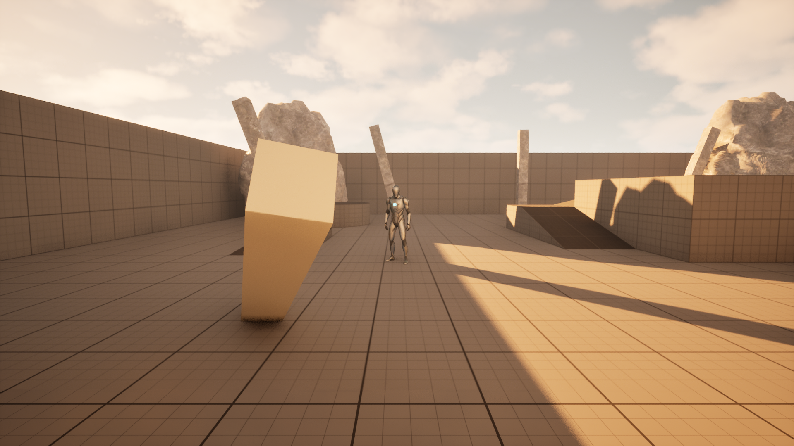
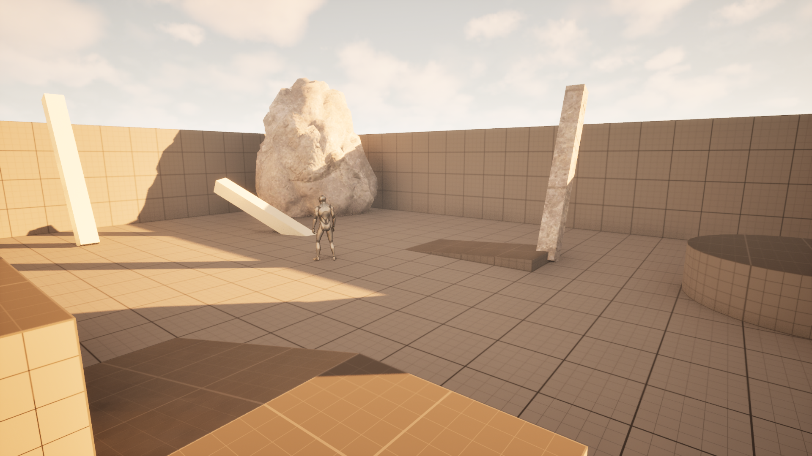

# ue5-multiplayer-action

Lyra-style PvE melee combat demo built on Unreal Engine 5.5 — full **Gameplay Ability System** (GAS) stack, multiplayer replication, AI driven by **BehaviorTree** sharing the same `GameplayAbility` C++ classes as the player. Personal portfolio project.

> Built alongside (and largely *with*) **UnrealAgentMCP** — a self-developed in-editor MCP server (57 tools / 55 automation tests) that lets an AI agent author Blueprints, UMG, AnimGraphs, BehaviorTrees and level content directly inside the running editor. Most of this project's content-side work (montages, GE configs, widget trees, BT nodes, AnimGraph layering, arena dressing) was authored agent-side through it. The plugin is developed in a separate **private** repo (demo available on request); it is not required to build or run this project.

| | |
|---|---|
|  |  |

---

## Highlights

| Area | What's in |
|---|---|
| **GAS 5 pillars** | `GameplayAbility` (LocalPredicted ×4: Melee / Sprint / Dodge / Fireball) · `GameplayEffect` (Damage Execution / Cooldown / Stamina Cost / Periodic Stamina Regen) · `AttributeSet` (Health/MaxHealth/Stamina/AttackPower/Armor + Damage meta) · `GameplayCue` (`Static` notify w/ `FHitResult` location/normal + data-driven C++ burst cue base) · `PredictionKey` |
| **Projectile netcode** | Lyra/GASShooter-style ranged AoE: predicted cast montage (instant client feedback) + **server-only spawn** of a replicated `AMAProjectile` carrying a damage spec **snapshotted at cast time** — the fireball lands with cast-time stats even if the caster dies mid-flight. AoE overlap applies the same ExecCalc to every ASC in radius; explosion FX replicate via GameplayCue. |
| **Damage formula** | `UGameplayEffectExecutionCalculation` capturing source `AttackPower` (snapshot) + target `Armor` (live), output to `Damage` meta-attribute, AS routes to `Health`. Lyra `ULyraDamageExecution` pattern. |
| **HUD architecture** | Self-contained C++ Views auto-wired by `UMAUserWidget::InitFromASC` tree scan: `UMAHealthBarWidget` (Street-Fighter-style **chip damage bar** — front fill drops instantly, a chip segment accumulates hits for 3 s then drains; styles force-built in `NativePreConstruct`) and `UMASkillSlotWidget` (cooldown sweep from active cooldown GE query + active-tag highlight). The **same chip-bar widget** doubles as the NPC overhead bar (`bHideUntilDamaged` — appears on first blood, re-hides at full). |
| **Animation** | Upper-body layering rig in `ABP_Manny` (cached full pose → `UpperBody` slot → layered blend per bone on `spine_01`) keeps the legs running while attack/cast montages play. `UMAAnimInstance` adds a **torso aim twist**: while `State.Attacking`/`State.Casting` is on the ASC, the spine chain rotates toward the camera yaw (clamped ±90°, interp-smoothed) — legs keep orient-to-movement, body language follows the crosshair. |
| **AI** | `BehaviorTree` + custom `UBTService_UpdateTargetInfo` (nearest **living** player, preferring **NavMesh-reachable** targets over closer unreachable ones) + custom `UBTTask_TryActivateAbilityByTag` (BT node → `ASC.TryActivateAbilitiesByTag`). AI calls the **same `UGA_MeleeAttack` C++ class** the player drives via Enhanced Input. |
| **Session front-end** | `UMASessionSubsystem` (GameInstance subsystem over the OnlineSubsystem session interface) with a UMG **MVVM** main menu — `UMAMainMenuViewModel` + FieldNotify bindings, ListView of discovered sessions, host/join/refresh with in-flight guards and network-failure recovery back to the menu. |
| **Networking** | Server-authoritative damage; `Mixed` ASC replication for players (cooldown to owner) + `Minimal` for NPCs. `NetMulticast` RPC for ragdoll (component state doesn't auto-replicate). `Server` RPC for dev cheats. |
| **Death/Respawn** | `IMACombatantInterface` abstraction; `State.Dead` loose tag gates re-activation; `UnPossess()` before `GameMode->RestartPlayer()` to force fresh pawn spawn (vs the engine's default teleport-existing). |

---

## Architecture

```
                                 SERVER (authority)
                                 ─────────────────
   AMAPlayerState                                          AMATargetDummy (NPC)
     ├─ UMAAbilitySystemComponent  (Mixed replication)       ├─ UMAAbilitySystemComponent  (Minimal replication)
     └─ UMAAttributeSet                                      └─ UMAAttributeSet
            ↑                                                       ↑
     [InitAbilityActorInfo(PS, Pawn)]                        [InitAbilityActorInfo(this, this)]
            ↑                                                       ↑
   AMultiPlayerActionCharacter                              AMATargetDummy
     (cached ASC ptr; no ASC ownership)                       (Pawn = Owner = Avatar)
                                                                    ↑
   AMAPlayerController                                       AMAEnemyController : AAIController
     ├─ Spawns + binds UMAUserWidget (WBP_HUD)                  └─ RunBehaviorTree(BT_Enemy)
     └─ DamageSelf (Server RPC) for testing                          ├─ Service: BTService_UpdateTargetInfo
                                                                     └─ BTTask_TryActivateAbilityByTag
                                                                            (AbilityTag = Ability.Melee.Attack)
                                                                            ↓
                                                                     Same UGA_MeleeAttack C++ class as player
```

### Damage flow

```
Player input (LMB)                            AI BT tick
     ↓                                         ↓
Enhanced Input → ASC.TryActivateAbilitiesByTag(Ability.Melee.Attack)
                                ↓
                    UGA_MeleeAttack::ActivateAbility (LocalPredicted)
                                ↓
                    CommitAbility → BP_GE_StaminaCost (-10 Stamina) + BP_GE_Cooldown_Melee (1s)
                                ↓
                    PlayMontageAndWait + WaitGameplayEvent (AnimNotify Event.Montage.Hit)
                                ↓
                    SERVER: PerformHitTrace → SphereSweep ECC_Pawn
                                ↓
                    Apply BP_GE_Damage (uses MADamageExecutionCalculation)
                                ↓
                    Source.AttackPower (snapshot) × (1 - Target.Armor × 0.05)
                                ↓
                    Output Damage meta-attribute on target ASC
                                ↓
                    Target AS::PostGameplayEffectExecute routes Damage → Health
                                ↓
                    On Health<=0: AS::CheckDeath → IMACombatantInterface::Execute_HandleDeath
                                ↓
                    NetMulticast_PlayDeath (ragdoll) + ScheduleRespawn(3s)
                                ↓
                    Respawn: UnPossess + GameMode.RestartPlayer → fresh pawn at PlayerStart
```

### Fireball flow (ranged AoE — predicted cast, authoritative projectile)

```
Player input (Q) → ASC.TryActivateAbilitiesByTag(Ability.Ranged.Fireball)
     ↓
UGA_Fireball::ActivateAbility (LocalPredicted — cast starts INSTANTLY on the owning client)
     ↓
CommitAbility (Stamina -20 + 3s cooldown) · MOBILE cast — montage on the UpperBody slot,
     legs keep running; torso aim-twists toward the camera (UMAAnimInstance, State.Casting)
     ↓
PlayMontageAndWait(AM_FireballCastUB) + WaitGameplayEvent(Event.Montage.SpawnProjectile)
     ↓ (release-frame AnimNotify, ~1.65s — windup masks the projectile's replication latency)
SERVER ONLY: snapshot damage spec (source AttackPower captured NOW)
     ↓
Aim = camera-ray impact point (heights work; ground shots are intentional AoE placement)
     ↓
SpawnActorDeferred<AMAProjectile> (bReplicates + movement replication) → InitProjectile(spec, radius)
     ↓
Impact (server): SphereOverlap(ECC_Pawn, r=300) — instigator excluded
     ↓
Apply snapshotted spec to every ASC in radius (same MADamageExecutionCalculation as melee)
     ↓
Source ASC ExecuteGameplayCue(GameplayCue.Fireball.Explosion) → replicated burst FX, then Destroy
```

### HUD binding (Lyra-style)

```
PlayerController.BeginPlay
     ↓ CreateWidget<UMAUserWidget>(WBP_HUD) + AddToViewport
PlayerController.OnRep_PlayerState
     ↓ HUDWidget->InitFromASC(PS->GetAbilitySystemComponent())
                  ↓
UMAUserWidget::InitFromASC binds:
   ASC->GetGameplayAttributeValueChangeDelegate(Health/MaxHealth/Stamina/AttackPower)
                  ↓
   BlueprintImplementableEvent OnHealthChanged / OnStaminaChanged / ...
                  ↓
   WBP_HUD (BP child) overrides events → ProgressBar.SetPercent(...)
```

Character / PlayerState carry **no HUD-facing API**. NPCs reuse the same widget base via `UWidgetComponent` for floating health bars — `MATargetDummy::BeginPlay` calls the same `InitFromASC` on the spawned widget.

---

## Module layout

```
Source/MultiPlayerAction/
├── MultiPlayerActionCharacter.{h,cpp}     Player pawn: input bindings, GAS init via PlayerState, IMACombatantInterface
├── MultiPlayerActionGameMode.{h,cpp}      Wires PlayerStateClass + PlayerControllerClass
├── AbilitySystem/
│   ├── MAAbilitySystemComponent.h         Custom ASC subclass (extension hook)
│   ├── MAAttributeSet.{h,cpp}             Replicated attrs + Damage meta + PostExecute clamping + CheckDeath helper
│   ├── MACombatantInterface.h             "anything that dies" abstraction, called by AS::CheckDeath
│   ├── MAGameplayTags.{h,cpp}             Native gameplay tags (Ability.* / GameplayCue.* / State.* / Event.*)
│   ├── AnimNotifies/
│   │   └── AN_SendGameplayEvent.{h,cpp}   Montage notify → SendGameplayEventToActor
│   ├── Abilities/
│   │   ├── MAGameplayAbilityBase.{h,cpp}  Base for all GAs (LocalPredicted + InstancedPerActor defaults)
│   │   ├── GA_MeleeAttack.{h,cpp}         Reference ability — montage + sphere trace + damage GE + GameplayCue
│   │   ├── GA_Sprint.{h,cpp}              Hold-to-activate sprint, periodic Stamina drain, auto-end on Stamina=0
│   │   ├── GA_Dodge.{h,cpp}               Dash + i-frame via State.Dodging ActivationOwnedTags (GE IgnoreTags)
│   │   └── GA_Fireball.{h,cpp}            Predicted cast + server-authoritative projectile spawn (cast-time spec snapshot)
│   ├── Cues/
│   │   └── GCN_ParticleBurst.{h,cpp}      Data-driven burst cue base — BP children are pure config, no graphs
│   └── Executions/
│       └── MADamageExecutionCalculation.{h,cpp}   Lyra-style damage formula (source AP snapshot × (1 - target Armor scale))
├── Combat/
│   └── MAProjectile.{h,cpp}               Server-authoritative replicated projectile: AoE overlap → spec → cue → destroy
├── Player/
│   ├── MAPlayerState.{h,cpp}              Owns ASC + AttributeSet
│   └── MAPlayerController.{h,cpp}         Spawns + binds HUD widget; ScheduleRespawn timer; DamageSelf Server RPC
├── Online/
│   └── MASessionSubsystem.{h,cpp}         GameInstance subsystem over OnlineSubsystem sessions (host/find/join,
│                                          in-flight guards, network-failure recovery to the menu)
├── Animation/
│   └── MAAnimInstance.{h,cpp}             Torso aim twist: spine-chain yaw toward camera, gated on State tags
├── UI/
│   ├── MAUserWidget.{h,cpp}               Abstract HUD widget base; auto-wires child Views in its tree
│   ├── MAHealthBarWidget.{h,cpp}          SF-style chip health bar (code-built rounded styles, hide-until-damaged mode)
│   ├── MASkillSlotWidget.{h,cpp}          Skill slot: cooldown sweep + active highlight + ability/hotkey label stack
│   └── MainMenu/                          MVVM front-end: MAMainMenuViewModel/Widget, MASessionListEntryVM/RowWidget
└── AI/
    ├── MATargetDummy.{h,cpp}              Pawn-owned ASC (Minimal rep), AI possess, overhead chip-bar component
    ├── MAEnemyController.{h,cpp}          AAIController + RunBehaviorTree on possess
    ├── BTTask_TryActivateAbilityByTag.{h,cpp}    BT task: ASC.TryActivateAbilitiesByTag(AbilityTag)
    └── BTService_UpdateTargetInfo.{h,cpp}        BT service: nearest living player, reachability-preferred
```

Content (BP / assets) under `Content/`:
- `AbilitySystem/Abilities/` — `BP_GA_MeleeAttack`, `BP_GA_Sprint`, `BP_GA_Dodge`, `BP_GA_Fireball`
- `AbilitySystem/GE/` — `BP_GE_Damage` (uses `MADamageExecutionCalculation`), `BP_GE_Cooldown_Melee`/`_Dodge`/`_Fireball`, `BP_GE_StaminaCost`/`_Fireball`, `BP_GE_StaminaRegen` (Periodic, OngoingTagRequirements suppresses during sprint)
- `AbilitySystem/Cues/` — `BP_GCN_MeleeHit` (`GameplayCueNotify_Static`, P_Sparks at `FHitResult.ImpactPoint`), `BP_GCN_FireballExplosion` (`GCN_ParticleBurst` child — pure data, no graph)
- `AbilitySystem/AM_Montage/` — `AM_MeleeStrikeUB`, `AM_FireballCastUB` (UpperBody-slot montages cropped from a Mage bundle + release-frame `AN_SendGameplayEvent`)
- `Characters/Mannequins/Animations/ABP_Manny` — upper-body layered blend rig + spine aim-twist chain (authored node-by-node via MCP AnimGraph tools)
- `Blueprints/Combat/` — `BP_Projectile_Fireball` (visuals on top of `AMAProjectile`)
- `Blueprints/AI/` — `BP_TargetDummy`, `BP_EnemyController`
- `AI/` — `BB_Enemy` (Blackboard), `BT_Enemy` (BehaviorTree)
- `Blueprints/UI/` — `WBP_HUD` (chip health bar + skill bar), `WBP_SkillSlot`, `WBP_MainMenu` (MVVM); `UI/` — `WBP_HealthBar` (shared player/NPC chip bar), `WBP_MASessionRowWidget`

> The bulk of the content above was authored **agent-side via UnrealAgentMCP** (private repo): montage creation/cropping, AnimNotify placement, GE configuration, BehaviorTree nodes, UMG widget trees + MVVM bindings, AnimGraph surgery (cached-pose/slot/layered-blend/ModifyBone chains) and the arena dressing all happened through MCP tools — several of which were built (with save/reload regression tests) precisely because this project needed them. That dogfooding loop is the second half of the portfolio.

---

## Build

Requirements:
- Unreal Engine **5.5** (matches `MultiPlayerAction.uproject` `EngineAssociation`)
- Visual Studio 2022 (Windows) / Xcode 15+ (macOS) with C++ workload
- Optional: Starter Content (used by `BP_GCN_MeleeHit`/`BP_GCN_FireballExplosion` for `P_Sparks`/`P_Explosion`/`P_Fire` particle templates)
- Optional: Mage Animation Bundle samples (source `AnimSequence` + skeleton for `AM_FireballCast`; the montage itself is committed, and `SK_Mannequin` carries a compatible-skeleton entry pointing at the bundle's skeleton — it dangles harmlessly as a soft reference if the bundle isn't installed, only the fireball cast animation degrades)

Steps:
```
git clone https://github.com/alertform/ue5-multiplayer-action.git
cd ue5-multiplayer-action
# Right-click MultiPlayerAction.uproject → "Generate Visual Studio project files"
# Open MultiPlayerAction.sln, set MultiPlayerActionEditor as startup, Build.
```

Or via UBT externally:
```
"<UE_5.5>/Engine/Build/BatchFiles/Build.bat" \
  MultiPlayerActionEditor Win64 Development \
  -Project="<absolute-path>/MultiPlayerAction.uproject" -WaitMutex
```

PIE: open `Content/Maps/ThirdPersonMap`, set Number of Players ≥ 2 to exercise multiplayer replication (or start from `Maps/MainMenu` and Host/Join through the session front-end). **LMB** melee, **Q** fireball (mobile upper-body cast, projectile flies at the camera-ray aim point), **Shift** sprint, **Ctrl** dodge i-frame — all four on the HUD skill bar with cooldown sweeps. Walk near the `BP_TargetDummy` placed in the map — it chases (NavMesh, reachability-aware targeting) and attacks via BT; its overhead chip bar appears on first blood. Console `DamageSelf 100` self-damages (Server RPC) to test ragdoll + respawn. Acceptance was also run at 100ms emulated latency (PIE Network Emulation).

---

## Notes for reviewers

- Code leans toward **C++ first, Blueprint composition only** — engine-level work, not BP scripting.
- Architecture decisions follow Lyra conventions where applicable (HUD widget binding, NPC ASC ownership, `Damage` meta-attribute routing, `BehaviorTree` + GAS integration, replication modes).
- Multiplayer correctness validated in PIE listen-server with 2 players: server-authoritative damage, attribute replication, ragdoll Multicast, owning-client HUD binding.
- Dev gotchas captured in commit messages — UE 5.5 deprecations (`SetAssetTags`, `SetNetUpdateFrequency`, GE Components system), the `RestartPlayer` teleport-existing trap, `NetMulticast` for component state, `bWarningsAsErrors` shadow-name pitfalls.

---

## License

No license declared yet — reach out before reusing code.
